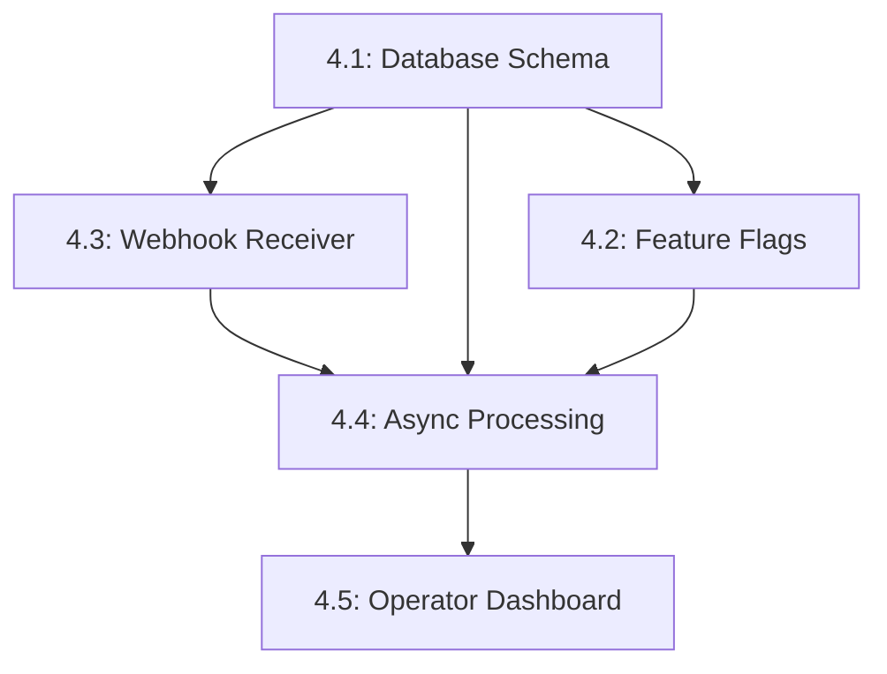

# Phase 4 Sprint Plan - Production Enablement
**Created:** January 23, 2026  
**Philosophy:** Following BUILD_PHILOSOPHY.md

---

## Sprint Goal

Transform the DRAFT_ONLY prototype into a production-ready system that:
1. Receives real HubSpot form submissions via webhook
2. Processes workflows asynchronously with retries
3. Stores all state in database (queryable + auditable)
4. Enables SEND mode with proper safety gates
5. Provides operator visibility via basic dashboard

---

## Task Execution Order



### Task 4.1 - Database Schema
**Owner:** Agent  
**Status:** ✅ COMPLETE

---

## Validation Checkpoints

### After Each Task (Atomic Commits)

✅ **Code Quality**
- [ ] All new code follows project conventions
- [ ] No syntax errors (verified with linter)
- [ ] Type hints added where applicable
- [ ] Error handling for edge cases

✅ **Testing**
- [ ] Unit tests pass locally
- [ ] Integration tests pass (if applicable)
- [ ] Manual validation commands documented
- [ ] Test coverage ≥80% for new code

✅ **Documentation**
- [ ] README updated if needed
- [ ] Inline comments for complex logic
- [ ] API contracts documented
- [ ] Rollback procedure noted

✅ **Observable**
- [ ] Structured logging added
- [ ] Key metrics logged (timing, counts)
- [ ] Error tracking in place

✅ **Committable**
- [ ] Single, focused change
- [ ] Commit message follows convention
- [ ] Can be merged independently
- [ ] Doesn't break existing functionality

---

## End-of-Sprint Demo

**Date:** Day 10 (End of Week 2)  
**Duration:** 15 minutes  
**Format:** Live demonstration + Q&A

### Demo Script

**1. Webhook Ingestion (3 min)**
```bash
# Submit test HubSpot form
# Show webhook received log
tail -f logs/app.log | grep "Webhook received"

# Show database record
psql $DATABASE_URL -c "SELECT * FROM form_submissions ORDER BY created_at DESC LIMIT 1;"
```

**2. Async Processing (3 min)**
```bash
# Show Celery worker processing
tail -f logs/celery.log

# Show workflow status progression
watch -n 2 "psql $DATABASE_URL -c 'SELECT id, status, started_at, completed_at FROM workflows ORDER BY created_at DESC LIMIT 5;'"
```

**3. Feature Flags (2 min)**
```bash
# Demo 1: SEND blocked in dev
export API_ENV=development MODE_DRAFT_ONLY=false
python -c "from src.config import get_settings; get_settings().validate_send_mode()"
# -> ValueError

# Demo 2: SEND allowed in production
export API_ENV=production MODE_DRAFT_ONLY=false ALLOW_AUTO_SEND=true
export SEND_EMAIL_ALLOWLIST='["sales@company.com"]'
python -c "from src.config import get_settings; get_settings().validate_send_mode()"
# -> Success with warning
```

**4. Operator Dashboard (5 min)**
- Navigate to http://localhost:8000/dashboard
- Show workflow list
- Click into workflow detail
- Filter by status
- Approve a pending draft
- Show auto-refresh updating table

**5. Error Handling (2 min)**
```bash
# Mock API failure to trigger retry
# Show error in database
psql $DATABASE_URL -c "SELECT * FROM workflow_errors ORDER BY created_at DESC LIMIT 3;"

# Show retry attempts in Celery logs
grep "Retrying" logs/celery.log
```

---

## Definition of Done (Sprint Level)

### Code
- [x] All 5 tasks merged to main
- [ ] No failing tests in CI/CD
- [ ] No critical linting errors
- [ ] Code reviewed (self-review + automated checks)

### Functionality
- [ ] HubSpot webhook → database → Celery → workflow → draft → task (E2E works)
- [ ] SEND mode toggleable via feature flags
- [ ] Dashboard shows workflow status
- [ ] Error handling with retries functional

### Documentation
- [ ] README.md updated with Phase 4 features
- [ ] CURRENT_STATUS.md reflects completion
- [ ] /docs/ contains setup guides for new features
- [ ] API endpoints documented (OpenAPI/Swagger)

### Demo
- [ ] Screen recording captured (3-5 min)
- [ ] Screenshots of key features saved
- [ ] Demo script validated (all steps work)

### Deployment
- [ ] docker-compose.yml includes all services
- [ ] Environment variables documented in .env.example
- [ ] Migrations run successfully
- [ ] Services start without errors

---

## Risk Mitigation

### If Running Behind Schedule

**Option 1: Descope Dashboard (Task 4.5)**
- Move dashboard to Phase 5
- Use psql queries for operator visibility
- Keeps core functionality intact

**Option 2: Simplify Async Processing (Task 4.4)**
- Keep synchronous processing for MVP
- Add Celery in Phase 5
- Webhook still works, just slower

**Option 3: Defer Feature Flags (Task 4.2)**
- Keep DRAFT_ONLY enforced
- Add SEND mode in Phase 5
- Reduces risk surface

**Decision Point:** End of Day 5 (mid-sprint review)

---

## Daily Standup Format

**What I completed yesterday:**
- Specific tasks/files
- Tests passing
- Blockers resolved

**What I'm working on today:**
- Current task
- Expected completion
- Any dependencies

**Blockers:**
- Technical issues
- Missing information
- External dependencies

**Progress:** X% of sprint complete

---

## Sprint Completion Criteria (Checklist)

### Task 4.1: Database Schema
- [ ] 5 SQLAlchemy models created
- [ ] Alembic migration generated
- [ ] Migration runs on fresh DB
- [ ] Unit tests pass
- [ ] Integration tests pass
- [ ] Models exported in __init__.py
- [ ] Rollback tested

### Task 4.2: Feature Flags
- [ ] Config validation implemented
- [ ] SEND mode blocked in non-prod
- [ ] Audit trail logs mode changes
- [ ] Unit tests cover all scenarios
- [ ] .env.example updated
- [ ] Backwards compatible

### Task 4.3: Webhook Receiver
- [ ] POST /api/webhooks/hubspot/forms works
- [ ] Signature validation passes/fails correctly
- [ ] Form submissions stored in DB
- [ ] Duplicate detection works
- [ ] Returns 202 immediately
- [ ] Integration tests pass
- [ ] Tested with real HubSpot webhook

### Task 4.4: Async Processing
- [ ] Celery worker starts
- [ ] process_workflow_task executes
- [ ] Workflow status updates in DB
- [ ] Retry logic works (3 attempts)
- [ ] Errors stored in DB
- [ ] Integration tests pass
- [ ] Works in docker-compose

### Task 4.5: Operator Dashboard
- [ ] Dashboard loads at /dashboard
- [ ] Workflow list displays
- [ ] Filter by status works
- [ ] Detail view functional
- [ ] Approve/reject drafts works
- [ ] Auto-refresh updates table
- [ ] API tests pass

---

## Post-Sprint Activities

### Sprint Retrospective (30 min)

**What went well:**
- List successes
- Celebrate wins

**What could improve:**
- Identify pain points
- Suggest solutions

**Action items:**
- Concrete improvements for next sprint
- Assign owners

### Sprint Summary Document

Create `PHASE4_COMPLETE.md` with:
- What shipped
- Stats (lines of code, tests, files)
- Demo artifacts (links to recordings/screenshots)
- Known issues/limitations
- Next sprint priorities

### Code Cleanup

- [ ] Remove TODO comments (or convert to issues)
- [ ] Delete dead code
- [ ] Update .gitignore if needed
- [ ] Run final linting pass

---

**Sprint Status:** READY TO START  
**Next Review:** End of Day 5 (mid-sprint checkpoint)  
**Completion Target:** Day 10

---

*This sprint plan follows the principles in BUILD_PHILOSOPHY.md: atomic tasks, clear validation, demoable output, no drama.*
